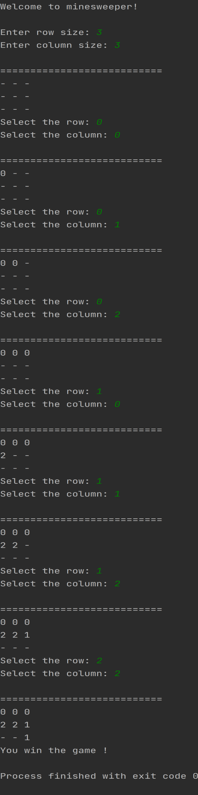

# MineSweeper

Minesweeper game made in java.

The game works on console. It reads row and column size from input, then initialize the game.  

Mines count are (rowSize * columnSize) / 4  
Every turn game prompts you to select a row and column.

# Winning Scenario 1

# Losing Scenario

# Winning Scenario 2

